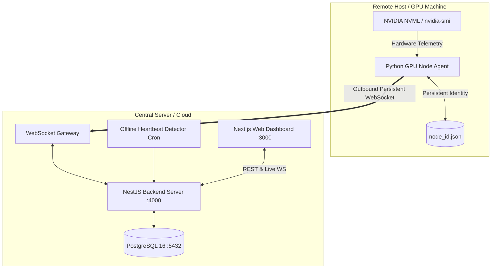
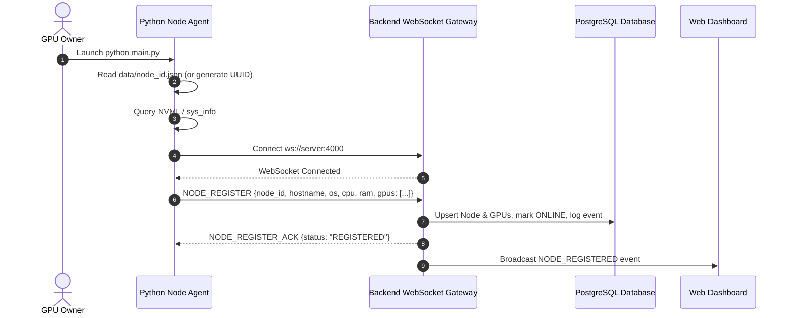
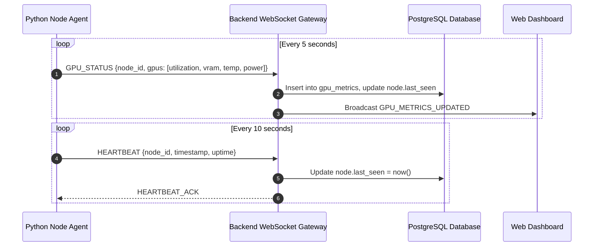
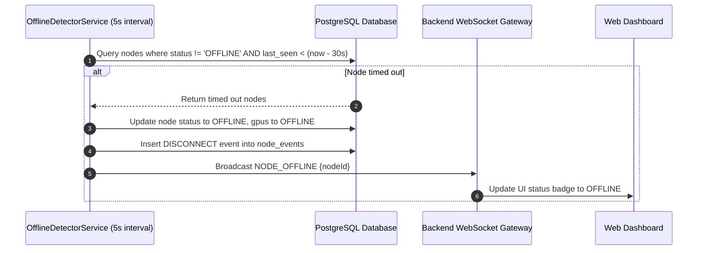
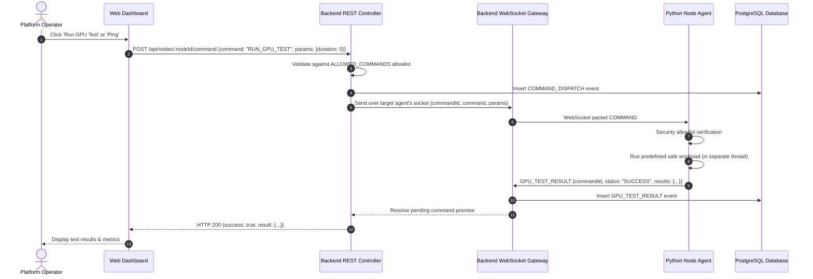

# P2P GPU Platform — Architecture Documentation (ARCHITECTURE.md)

This document details the system design, communication protocols, state machines, and data flows of the P2P GPU Platform MVP.

---

## 1. High-Level System Architecture

---

## 2. Component Responsibilities

### 2.1 Python Node Agent
- **Outbound Connection:** Initiates an outbound WebSocket connection to the backend server. Requires zero inbound ports or public IP.
- **Hardware Telemetry:** Direct driver interaction via `pynvml` (primary) and `nvidia-smi` (fallback) to inspect core utilization, VRAM usage, temperature, power, and driver version. No mock data is ever fabricated.
- **Persistent Identity:** Automatically generates a UUIDv4 node ID on first run, saves it to `data/node_id.json`, and preserves the same identity across reboots.
- **Periodic Streaming:** Sends `NODE_REGISTER` on connect, `HEARTBEAT` every 10 seconds, and `GPU_STATUS` telemetry every 5 seconds.
- **Exponential Backoff Reconnection:** Automatically reconnects upon network drops or server restarts using jittered exponential backoff (1s -> 2s -> 4s -> ... -> 60s max).
- **Zero-RCE Predefined Command Runner:** Strictly allowlists commands (`PING`, `GET_SYSTEM_INFO`, `GET_GPU_STATUS`, `SET_NODE_AVAILABILITY`, `RUN_GPU_TEST`) and rejects any arbitrary shell or script execution.

### 2.2 NestJS Backend & Control Server
- **WebSocket Gateway (`NodesGateway`):** Accepts and routes bidirectional messages with agents and web dashboards.
- **Connection Registry:** Tracks live WebSocket connections, maps sockets to `node_id`, and manages dispatch timeouts.
- **Database Persistence (`NodesService`):** Persists node info, GPU specs, metric time-series, and audit events in PostgreSQL using TypeORM.
- **Offline Detector Service:** A scheduled sweep running every 5 seconds that identifies nodes whose `last_seen` timestamp exceeds the timeout (~30s), marks them `OFFLINE`, updates their GPUs to `OFFLINE`, and alerts connected dashboards.
- **Safe Command Dispatcher:** REST endpoint (`POST /api/nodes/:nodeId/command`) that validates input against the command allowlist, dispatches the request to the target agent over WebSocket, awaits response with timeout, and logs audit events.

### 2.3 Web Dashboard (Next.js)
- **Real-Time Overview:** Displays count of online/offline nodes, total GPUs, and active GPUs.
- **Node Grid & Cards:** Shows hardware specs, live GPU metrics, utilization progress bars, and status badges.
- **Interactive Control Modal:** Inspects full node hardware, real-time GPU gauges (VRAM, utilization, temp, power), triggers safe allowlisted actions, and views recent node audit events.

### 2.4 PostgreSQL Database
- `nodes`: Hostname, OS, CPU, RAM, status, last_seen, timestamps.
- `gpus`: Node reference, index, UUID, name, total VRAM, driver version, availability.
- `gpu_metrics`: Time-series telemetry (utilization, VRAM used/free, temperature, power draw/limit).
- `node_events`: Immutable audit trail for registrations, disconnections, command dispatches, command completions, and errors.

---

## 3. Communication & Data Flows

### 3.1 Node Registration Flow

### 3.2 Periodic Telemetry & Heartbeat Flow

### 3.3 Offline Detection Flow

### 3.4 Safe Command Execution Flow

